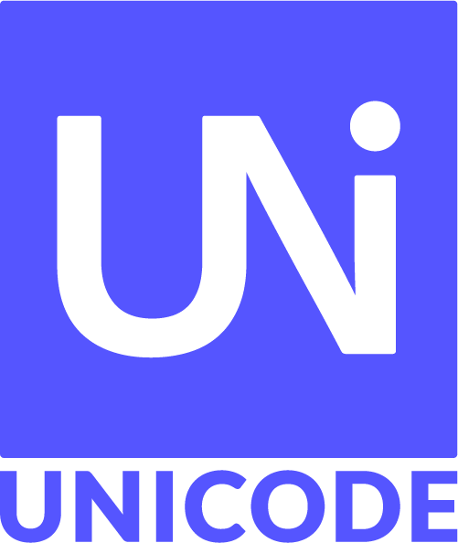
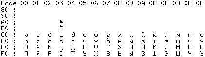
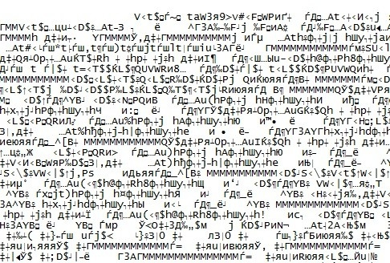
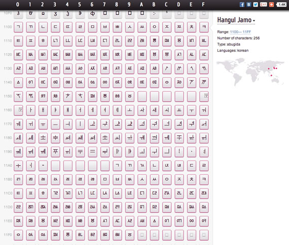
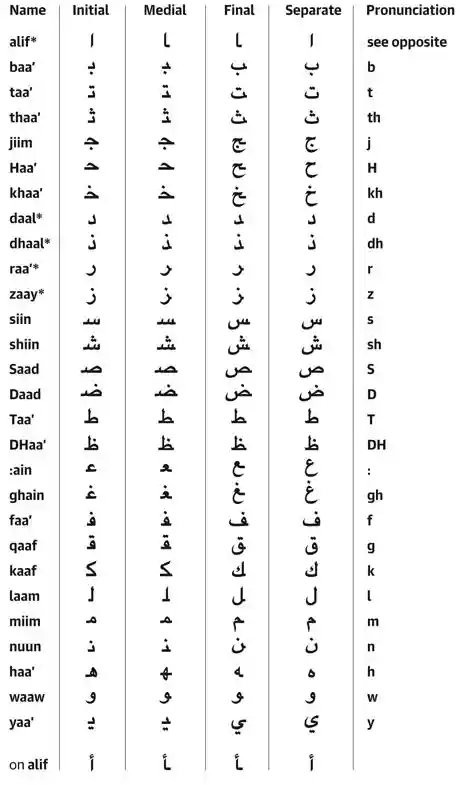

Логотип Unicode</img>

# Unicode: основные понятия и принципы

## Что такое Unicode?

> Unicode присваивает каждому символу уникальный номер. Вне зависимости от платформы. Вне зависимости от программы. Вне зависимости от языка.
>
> *unicode.org*

**Unicode** (*рус. Юникод*) — это универсальный стандарт кодирования символов, в настоящее время получивший самое широкое распространение как в Интернете, так и в большинстве программных продуктов. Стандарт кодирования символов (или *кодировка*) определяет, в каком виде обрабатывается, хранится и передается текстовая информация.

Unicode — это стандарт, позволяющий отображать и обрабатывать **все основные письменности мира**. Он не привязан к конкретной операционной системе или устройству, что позволяет свободно обрабатывать и передавать текстовую информацию.

## Краткая история: зачем понадобился Unicode?

До изобретения Unicode существовали сотни различных кодировок. Их общим предком можно считать ASCII — American Standard Code for Information Interchange (*рус. Американская стандартная кодировка для обмена информацией*), которая была изобретена в 1963 году. Как ASCII, так и все её  аналоги имели ряд серьёзных недостатков:

- ***Ограничение по количеству символов*.** Этот недостаток был обусловлен тем, что более ранние версии кодировок использовали **1 байт** для обозначения одного символа. Поэтому в рамках такой однобайтовой системы можно было закодировать всего 256 символов - при этом, первые 128 позиций уже были заняты управляющими символами и латиницей. Это ограничение привело к созданию **огромного числа кодировок** для самых разных языков. Например, русской версией кодировки ANSI была *KOI8-R*:

  

  
*Таблица, представляющая последние 128 символов KOI-8R*

- ***Несовместимость различных кодировок*.** Помимо того, что для каждого языка и системы письменности требовалась своя собственная кодировка, совместимости между кодировками для различных языков не существовало. **Один и тот же символ мог обрабатываться различными номерами**, что приводило к проблемам отображения информации: например, при отсутствии кодировки KOI-8R вместо русского текста на экране могли отображаться символы, соответствующие используемой в данный момент кодировке (*т.н. "кракозябры"*):

  

  
*Пример отображения текста в неправильной кодировке*

- ***Трудности при передаче текстовой информации.*** Предыдущий недостаток сформировал глобальную проблему, характерную для всех однобайтных кодировок. При переносе файлов между устройствами под управлением различных ОС необходимо было иметь шрифты, соответствующие кодировке этих файлов, или программы-конвертеры, поскольку всегда существовал риск, что текст в другой системе будет отображен неверно. Соответственно, **существование сети Интернет в её нынешнем виде было невозможно**.

  

  > Unicode изменил всё это!
  >
  > *unicode.org*

Стандарт Unicode, разработанный в 1991 году некоммерческой организацией Unicode Consortium (*англ. Консорциум Юникода*), объединил огромное количество символов и систем письменности различных языков в универсальную систему, в которой **каждому отдельному символу был присвоен свой уникальный номер**. Такая унификация позволила разделаться с указанными выше недостатками и даже сделать кодовую область стандарта **расширяемой**: она регулярно дополняется новыми символами и по сей день.

*Фрагмент кодовой области Unicode*

В стандартном Unicode для кодирования каждого символа выделяется 31 бит. Соответственно, количество возможных комбинаций для кодирования составляет **2^31** или **2 147 483 684**. Это количество позволяет закодировать все существующие системы письменности, а также астрономическое количество графических символов.

В последней на данный момент версии **Unicode 13.0** (*представлена в марте 2020 г.*) используется всего **143 859** кодовых позиций. При этом, при последнем обновлении в неё были включены несколько систем письменности редких языков и 55 новых эмодзи. Как можно понять из этого факта, места в системе ещё очень и очень много.

## Чем уникален Unicode?

Как уже было сказано выше, Unicode позволил объединить все системы письменности в **универсальный стандарт**, не зависящий от используемой платформы или чего бы то ни было ещё.

Можно догадаться, что подобная унификация была амбициозной и нетривиальной задачей — ведь за тысячи лет записанной истории человечество изобрело великое множество систем письменности, тем или иным образом отражающих фонетические особенности огромного числа языков. По мере своего развития, алфавиты многих языков усложнялись, обрастали диакритическими знаками и различными вариантами написания. Также многие системы письменности (например, арабская, персидская или урду) записываются справа налево, что значительно усложняет их отображение.

*Фрагмент арабского алфавита. Представлены варианты написания символов в начале, середине и конце слов, а также их обособленный вид*

Успешное выполнение этой задачи и сделало Unicode наиболее популярной на сегодняшний день системой кодирования символов.

Так, Unicode позволяет **комбинировать различные символы**, чтобы обеспечить возможность их написания с необходимыми диакритическими знаками. Это было достигнуто за счет разделения символов на основные (*англ. base characters*) и комбинируемые (*англ. combining characters*).

## Способы представления символов в Unicode (UTF)

Юникод имеет несколько форм представления (англ. *Unicode Transformation Format, UTF*): UTF-8, UTF-16 (UTF-16BE, UTF-16LE) и UTF-32 (UTF-32BE, UTF-32LE). Была  разработана также форма представления UTF-7 для передачи по семибитным  каналам, но из-за несовместимости с ASCII она не получила  распространения и не включена в стандарт.

### UTF-8

UTF-8 — представление Юникода, обеспечивающее наилучшую совместимость со старыми системами, использовавшими 8-битные символы. Текст, состоящий только из символов с номером меньше 128, при записи в UTF-8 превращается в обычный текст ASCII. И наоборот, в тексте UTF-8 любой байт со значением меньше 128 изображает символ ASCII с тем же кодом. Остальные символы Юникода  изображаются последовательностями длиной от двух до шести байт.

### UTF-16

UTF-16 — один из способов кодирования символов (англ. *code point*) из Unicode в виде последовательности 16-битных слов (англ. *code unit*). Данная кодировка позволяет записывать символы Юникода в диапазонах U+0000..U+D7FF и U+E000..U+10FFFF (общим количеством 1 112 064), причем 2-байтные символы представляются как есть, а более длинные — с помощью суррогатных пар (англ. *surrogate pair*).

### UTF-32

UTF-32 — один из способов кодирования символов из Юникод, использующий для кодирования любого символа ровно 32 бита. В отличие от UTF-32, UTF-8 и UTF-16, используют для представления символов переменное число байт. Символ UTF-32 является прямым  представлением его кодовой позиции (англ. *code point*).

Главное преимущество UTF-32 перед кодировками переменной длины  заключается в том, что символы Юникод непосредственно индексируемы.  Получение **n**-ой кодовой позиции является операцией, занимающей одинаковое время.  Напротив, коды с переменной длиной требует последовательного доступа к **n**-ой кодовой позиции. Это делает замену символов в строках UTF-32 простой,  для этого используется целое число в качестве индекса, как обычно  делается для строк ASCII.

Главный недостаток UTF-32 — это неэффективное использование  пространства, так как для хранения символа используется четыре байта.  Символы, лежащие за пределами нулевой (базовой) плоскости кодового  пространства редко используются в большинстве текстов. Поэтому удвоение, в сравнении с UTF-16, занимаемого строками в UTF-32 пространства не оправдано.